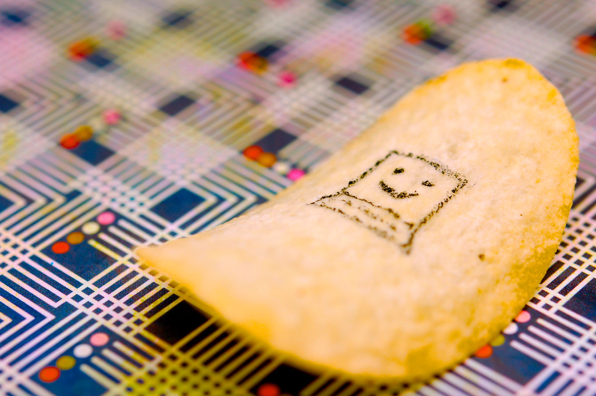

# Research Topics

We conduct research on ...



<!-- ======= 这里是自定义 feature 区块（Mobility）======= -->

  <!-- 左侧图片 -->
  

  <!-- 右侧内容区 -->
  

    <h2 style="font-size: 2rem; font-weight:600; margin-bottom: 1rem;">Mobility</h2>
    
TBD

    

      
        Computer Vision
      
      Deep Learning
      NLP
      VLMs
      Video Models
      Read More
    

  

  <!-- 左侧图片 -->
  

  <!-- 右侧内容区 -->
  

    <h2 style="font-size: 2rem; font-weight:600; margin-bottom: 1rem;">Construction</h2>
    
TBD

    

      
        Computer Vision
      
      Deep Learning
      NLP
      VLMs
      Video Models
      Read More
    

  

  <!-- 左侧图片 -->
  

  <!-- 右侧内容区 -->
  

    <h2 style="font-size: 2rem; font-weight:600; margin-bottom: 1rem;">Management</h2>
    
TBD

    

      
        Computer Vision
      
      Deep Learning
      NLP
      VLMs
      Video Models
      Read More
    

  

